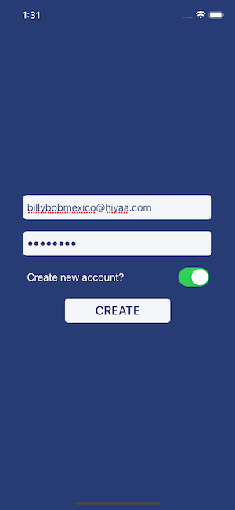

# SwiftUI Firebase Auth

A simple way for me to mess around with Firebase Authentication using Swift. A user can sign in or toggle create account to sign up using email and password.

## Screenshots

  
